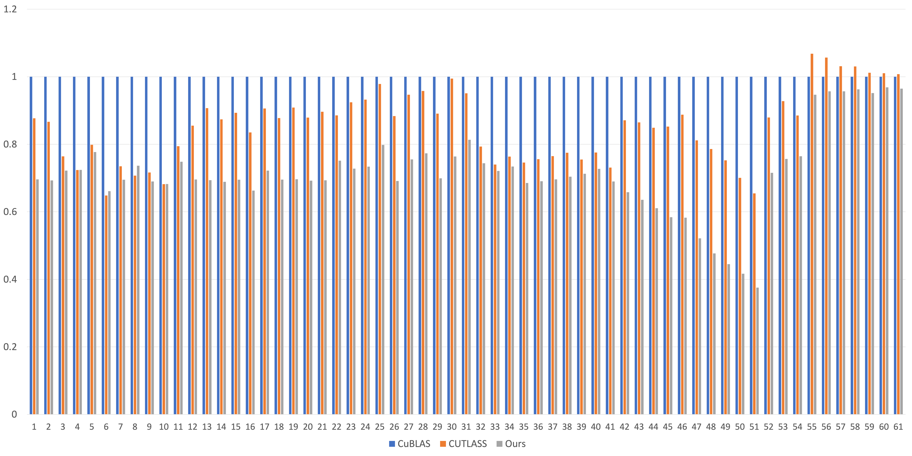
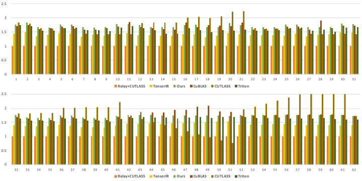
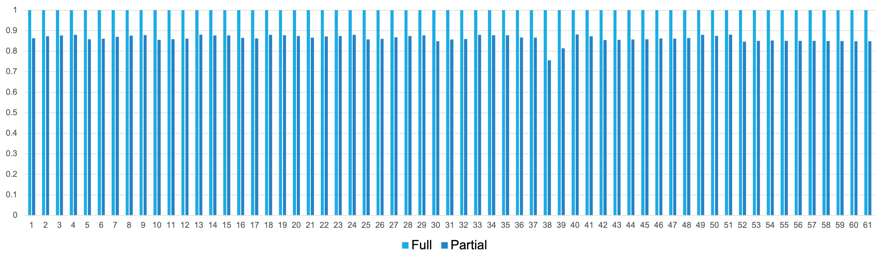

# TensorOp Matmul Tutorial

> This is an example repo for CUDA MatMul implementation. The aim of this repo is to provide some insights in high-performance kernel design for CUDA beginners. Currently, I only provide some implementation examples in `examples/matmul/this`.
Contributions for more kernels and other MatMul implementations are highly welcomed.

## About
There is a detailed [explanation](https://zhuanlan.zhihu.com/p/631227862) about the different versions of MatMul kernels in `examples/matmul/this`.

## Contents
- `examples`:

    - `matmul`: The MatMul implementations
        - `this-sm90`: The Hopper version Matmul
        - `this-sm80`: The MatMul implemented by this repo
        - `cublas`: Call CuBLAS for performance test
        - `cutlass`: Call CUTLASS for performance test
        - `mlir-gen`: The cuda code generated by MLIR
        - `triton`: Call Triton for performance test
        - `tvm`: Call Relay+CUTLASS/CuBLAS or TensorIR for performance test

   -  `atom`: The usage of single intrinsic/instructions

   -  `reduction`: Some reduction kernels for epilogue

# Performance Results

## Performance on H100 GPU

The current version only achieves on average 70% performance of CuBLAS. I am still working on improving the performance.

## Performance on A100 GPU
<!--  -->

The overall performance comparison among Relay, CuBLAS, CUTLASS, TensorIR, Triton, and our implementations. The y-axis is speedup to Relay+CUTLASS.

**Overall, the geometric mean speedup to Relay+CUTLASS is 1.73x, to TensorIR (1000 tuning trials using MetaSchedule per case) is 1.22x, to CuBLAS is 1.00x, to CUTLASS is 0.999x, to Triton is 1.07x.**
The 61 shapes are:

|No.|M|N|K|
|---|---|---|---|
|1|5376|5376|2048|
|2|5376-128|5376|2048|
|3|5376-2*128|5376|2048|
|...|...|...|...|
|11|5376-10*128|5376|2048|
|12|5376+128|5376|2048|
|13|5376+2*128|5376|2048|
|...|...|...|...|
|21|5376+10*128|5376|2048|
|22|5376|5376-128|2048|
|23|5376|5376-2*128|2048|
|...|...|...|...|
|31|5376|5376-10*128|2048|
|32|5376|5376+128|2048|
|33|5376|5376+2*128|2048|
|...|...|...|...|
|41|5376|5376+10*128|2048|
|42|5376|5376|2048-128|
|43|5376|5376|2048-2*128|
|...|...|...|...|
|51|5376|5376|2048-10*128|
|52|5376|5376|2048+128|
|53|5376|5376|2048+2*128|
|...|...|...|...|
|61|5376|5376|2048+10*128|

### MLIR Generated CUDA kernels
I also use MLIR to generate MatMul kernels. The generated ones are in `examples/matmul/mlir-gen`. The performance to handwritten ones (`examples/matmul/this`) is shown as belows. As MLIR generated ones only implement part of the optimizations used by handwritten ones, we call the MLIR generated ones `partial` and the handwritten ones `full`.

**Overall, MLIR generated versions achieve 86% the performance of handwritten kernels.**

# Plan
## More kernels
I plan to implement kernels for other operators such as softmax in future.

## Use CUTLASS in implementation
There is a plan to use the CuTe interface of CUTLASS to implement high-performance kernels.